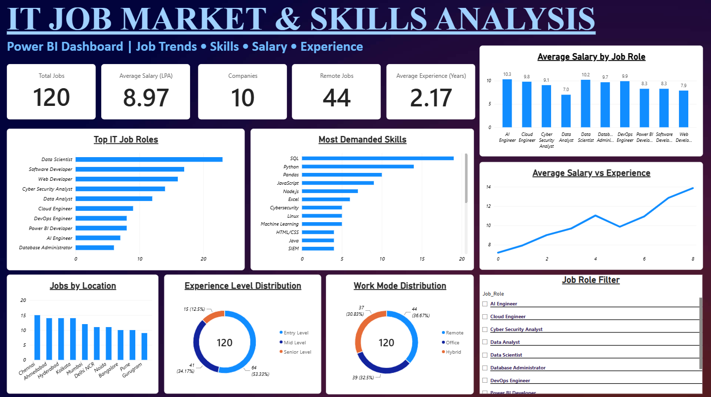

# 📊 IT Job Market & Skills Analysis Dashboard

An interactive **Power BI dashboard** designed to analyze IT job-market data across job roles, technical skills, salary, experience, location, and work mode.

## 🚀 Project Overview

This project transforms raw IT job data into an interactive dashboard using **Microsoft Power BI, Excel, and DAX**.

The dashboard helps explore:

- IT job role demand
- Most demanded technical skills
- Average salary by job role
- Salary vs. experience
- Job opportunities by location
- Experience-level distribution
- Remote, Hybrid, and Office work modes

## 📸 Dashboard Preview



## 📈 Key Metrics

| Metric | Value |
|---|---:|
| Total Job Records | 120 |
| Companies | 10 |
| Average Salary | 8.97 LPA |
| Remote Jobs | 44 |
| Average Experience | 2.17 Years |

## 🛠️ Tools & Technologies

- Microsoft Power BI
- Microsoft Excel
- DAX
- Data Analysis
- Data Cleaning
- Data Visualization
- Dashboard Development

## 📊 Dashboard Features

### 1. Top IT Job Roles
Visualizes job records across different IT roles such as:

- Data Scientist
- Software Developer
- Web Developer
- Cyber Security Analyst
- Data Analyst
- Cloud Engineer
- DevOps Engineer
- Power BI Developer
- AI Engineer
- Database Administrator

### 2. Most Demanded Skills
Analyzes the frequency of technical skills required across the dataset, including:

- SQL
- Python
- Pandas
- JavaScript
- Node.js
- Excel
- Cybersecurity
- Linux
- Machine Learning
- HTML/CSS
- Java
- SIEM

### 3. Salary Analysis
Provides:

- Average salary by job role
- Salary trends across experience levels
- Comparison of salary and experience

### 4. Job Location Analysis
Compares job opportunities across major Indian locations.

### 5. Experience Analysis
Shows the distribution of:

- Entry Level
- Mid Level
- Senior Level

### 6. Work Mode Analysis
Analyzes:

- Remote
- Hybrid
- Office

### 7. Interactive Job Role Filter
Users can select a specific job role and dynamically analyze the dashboard.

## 📂 Project Files

```text
IT-Job-Market-PowerBI-Dashboard/
│
├── IT_Job_Market_Dashboard.pbix
├── IT_Job_Market_Analysis.xlsx
├── IT_Job_Market_Dashboard.png
└── README.md
